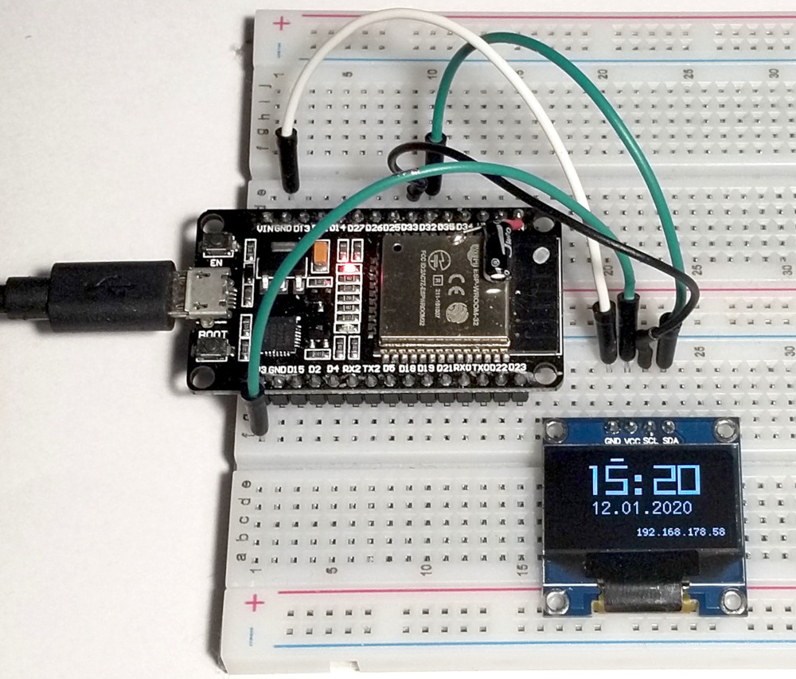
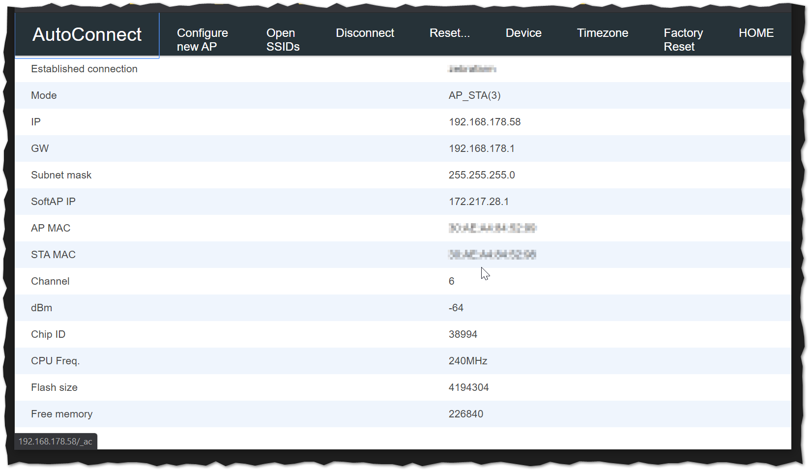

# ESP32Clock

## Features

- Gets time from NTP
- mDNS
- Access Point mode for configuration via Browser
  - Name
  - Timezone
  - Factory Reset
- Arduino OTA Update possible (OTA = Over The Air)
- 128x64 OLED Display
  - Time
  - Date
  - IP/Connection state
- Values are stored in NVM

## Connection

|ESP32|OLED Display|
|-|-|
|D32|SDA|
|D33|SCL|

## ToDo

- Using Preferences instead own abstracton layer for NVM.
- Move files on toplevel to subfolders.
- Move configserver_menu.json to src folder.

## Build and Upload

- Download and install Visual Studio Code
- Install PlatformIO as Visual Studio Code plugin
- Download or clone this project
- Open with with PlatformIO/Visual Studio Code
- Open platformio.ini and change IP (for OTA Updates) and/or Port (at least for first update to enable OTA updates) for your device.
- Build and Upload

## Configuration

- If the device is uninitialized it spawns a new Access Point you can connect.
- Configure AP and Reset.
- The device is now available into the configured network. IP is on the right bottom of display;
